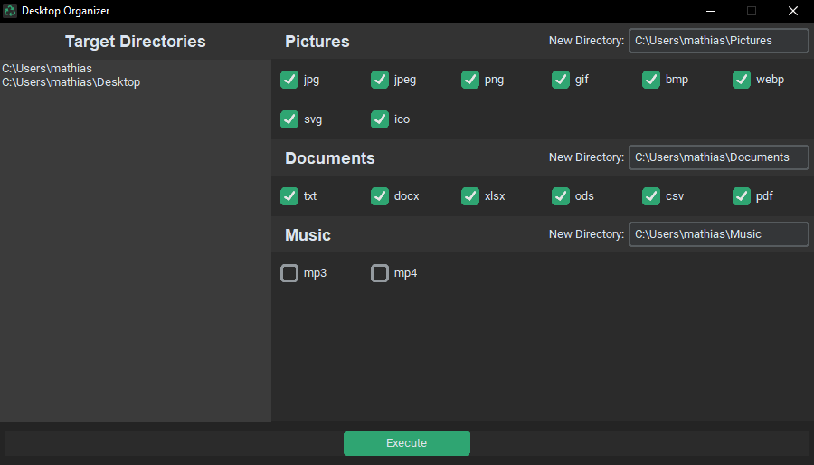

# Desktop Cleanup

Move files to their specified directories with a single button press.




## Create virtual environment and install dependencies

```
py -m venv env
.\env\Scripts\activate
pip install -r requirements.txt
```

## Build app with pyinstaller

```
pyinstaller main.spec
```